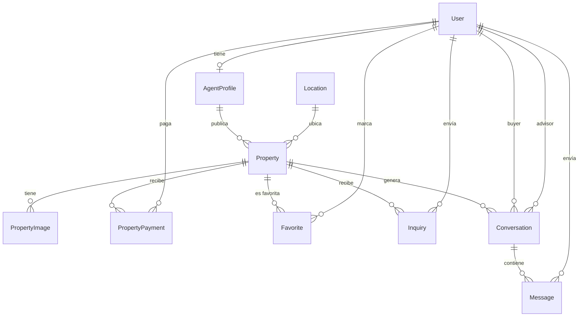
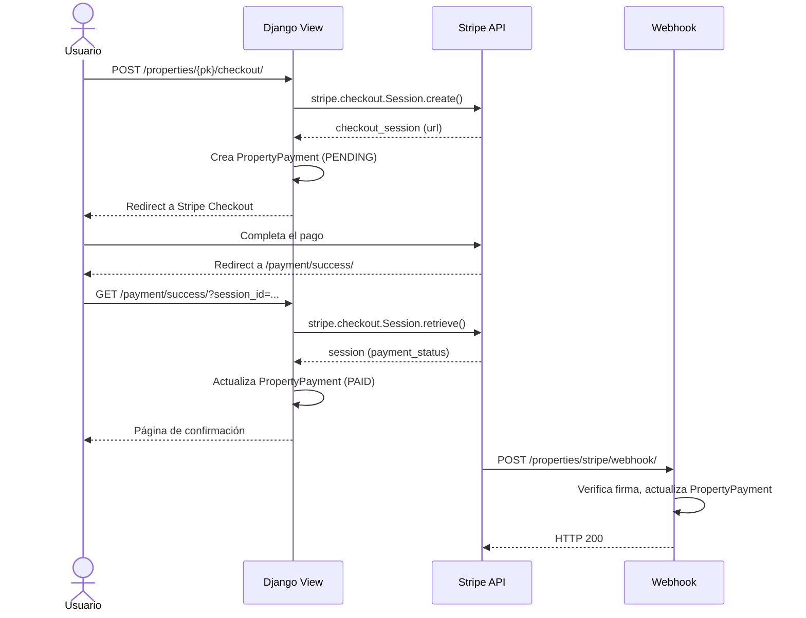

# 📘 Inmobilike It — Onboarding del Proyecto

> Guía completa para nuevos miembros del equipo. Este documento cubre la visión del proyecto, las tecnologías utilizadas, la funcionalidad implementada y la lógica de negocio.

---

## 📋 Tabla de Contenidos

1. [Descripción General](#-descripción-general)
2. [Stack Tecnológico](#-stack-tecnológico)
3. [Estructura del Proyecto](#-estructura-del-proyecto)
4. [Funcionalidades Implementadas](#-funcionalidades-implementadas)
5. [Lógica de Negocio](#-lógica-de-negocio)
6. [Arquitectura de Software](#-arquitectura-de-software)
7. [Base de Datos](#-base-de-datos)
8. [WebSockets y Tiempo Real](#-websockets-y-tiempo-real)
9. [Integración con Stripe](#-integración-con-stripe)
10. [Testing](#-testing)
11. [Configuración y Variables de Entorno](#-configuración-y-variables-de-entorno)
12. [Instalación y Ejecución](#-instalación-y-ejecución)
13. [Endpoints y Rutas](#-endpoints-y-rutas)
14. [Convenciones del Código](#-convenciones-del-código)

---

## 🎯 Descripción General

**Inmobilike It** es una plataforma inmobiliaria web completa tipo Airbnb/Fincaraíz que permite a los usuarios:

- **Buscar y explorar** propiedades en venta o arriendo con filtros avanzados.
- **Publicar propiedades** como anfitrión (modo host).
- **Interactuar** con propietarios/asesores a través de un **chat en tiempo real**.
- **Marcar favoritos**, enviar consultas y **comparar** propiedades.
- **Realizar pagos** a través de la pasarela **Stripe**.

El proyecto fue desarrollado como proyecto académico de la materia **Tópicos de Ingeniería de Software**, aplicando patrones de diseño, buenas prácticas de desarrollo y principios de arquitectura limpia.

---

## 🛠️ Stack Tecnológico

### Backend

| Tecnología | Versión | Propósito |
|-----------|---------|-----------|
| **Python** | 3.11 | Lenguaje principal |
| **Django** | 4.2.16 | Framework web (MTV) |
| **Django Channels** | 4.3.2 | WebSockets para chat en tiempo real |
| **Daphne** | 4.2.1 | Servidor ASGI (HTTP + WebSocket) |
| **Twisted** | 25.5.0 | Motor de red asíncrono para Channels |
| **Stripe** | 12.5.0 | Pasarela de pagos |
| **psycopg2-binary** | 2.9.9 | Driver de PostgreSQL |
| **Pillow** | 10.4.0 | Procesamiento de imágenes |
| **python-dotenv** | 1.0.1 | Gestión de variables de entorno |

### Base de Datos

| Tecnología | Versión | Propósito |
|-----------|---------|-----------|
| **PostgreSQL** | 16 | Base de datos relacional principal |

### Infraestructura

| Tecnología | Propósito |
|-----------|-----------|
| **Docker** | Contenedorización de la aplicación |
| **Docker Compose** | Orquestación de servicios (web + db) |

### Frontend

| Tecnología | Propósito |
|-----------|-----------|
| **HTML5 + Django Templates** | Renderizado del lado del servidor (SSR) |
| **CSS personalizado** | Estilos visuales (clases Tailwind-like manuales) |
| **JavaScript (vanilla)** | WebSocket client, interactividad y formateo de precios |

---

## 📁 Estructura del Proyecto

```
Inmobilike_It/
├── config/                          # Configuración de Django
│   ├── settings.py                  # Settings principal
│   ├── urls.py                      # Enrutamiento HTTP global
│   ├── asgi.py                      # Punto de entrada ASGI (HTTP + WS)
│   └── wsgi.py                      # Punto de entrada WSGI (solo HTTP)
│
├── apps/                            # Aplicaciones del dominio
│   ├── core/                        # App base (home, utilidades)
│   │   ├── urls.py
│   │   └── views.py
│   │
│   ├── accounts/                    # Gestión de usuarios y autenticación
│   │   ├── models.py                # AgentProfile
│   │   ├── forms.py                 # LoginForm, RegisterForm
│   │   ├── views.py                 # Login, Register, Profile, ToggleMode
│   │   └── urls.py
│   │
│   ├── properties/                  # Dominio de propiedades
│   │   ├── models.py                # Property, Location, PropertyImage, PropertyPayment
│   │   ├── forms.py                 # PropertyForm, LocationForm
│   │   ├── views.py                 # CRUD, Pagos Stripe, Catálogo
│   │   ├── utils.py                 # normalize_decimal_input()
│   │   ├── urls.py
│   │   ├── repositories/            # Capa de acceso a datos
│   │   │   ├── base.py              # PropertySearchEngine (ABC)
│   │   │   ├── orm_search.py        # ORMPropertySearch
│   │   │   ├── elasticsearch_search.py  # ElasticPropertySearch (stub)
│   │   │   └── property_repository.py   # PropertyRepository
│   │   ├── services/                # Capa de lógica de negocio
│   │   │   ├── property_service.py  # PropertyService
│   │   │   ├── search_service.py    # AdvancedSearchService
│   │   │   └── comparison_service.py # ComparisonService
│   │   └── tests/
│   │       └── test_properties.py
│   │
│   └── interactions/                # Dominio de interacciones
│       ├── models.py                # Favorite, Inquiry, Conversation, Message
│       ├── consumers.py             # ChatConsumer, NotificationConsumer
│       ├── routing.py               # WebSocket URL patterns
│       ├── context_processors.py    # chat_notifications (global)
│       ├── forms.py                 # InquiryForm
│       ├── views.py                 # Favoritos, Inquiries, Chat Dashboard
│       ├── urls.py
│       ├── repositories/
│       │   ├── favorite_repository.py
│       │   └── inquiry_repository.py
│       ├── services/
│       │   ├── favorite_service.py
│       │   └── contact_service.py
│       └── tests/
│           └── test_interactions.py
│
├── templates/                       # Templates globales
│   ├── base.html                    # Layout principal
│   ├── accounts/                    # Templates de autenticación
│   ├── core/                        # Homepage
│   ├── properties/                  # Catálogo, detalle, CRUD, pagos
│   └── interactions/                # Chat, favoritos, inquiries
│
├── static/                          # Archivos estáticos (CSS, JS, imágenes)
├── media/                           # Archivos subidos por usuarios (imágenes)
├── Dockerfile                       # Imagen Docker de la aplicación
├── docker-compose.yml               # Orquestación Docker (web + PostgreSQL)
├── requirements.txt                 # Dependencias de Python
├── manage.py                        # CLI de Django
└── .env                             # Variables de entorno (no se sube al repo)
```

---

## ✅ Funcionalidades Implementadas

### 🏠 Gestión de Propiedades

| Funcionalidad | Descripción |
|--------------|-------------|
| **Catálogo público** | Listado de todas las propiedades activas con filtros por ciudad, barrio, tipo de operación y rango de precios |
| **Detalle de propiedad** | Vista completa con galería de imágenes, información del agente y acciones contextuales |
| **Crear propiedad** | Formulario con ubicación, datos de la propiedad y subida de múltiples imágenes (solo modo anfitrión) |
| **Editar propiedad** | Modificación de datos, adición/eliminación de imágenes y selección de imagen de portada |
| **Eliminar propiedad** | Eliminación con confirmación (solo el agente propietario) |
| **Búsqueda avanzada** | Motor de búsqueda con Strategy Pattern que soporta ORM y Elasticsearch |
| **Comparación** | Comparar múltiples propiedades lado a lado con métricas como precio/m² |

### 👤 Gestión de Usuarios

| Funcionalidad | Descripción |
|--------------|-------------|
| **Registro** | Creación de cuenta con formulario personalizado |
| **Login / Logout** | Autenticación basada en sesiones de Django |
| **Perfil** | Vista del perfil del usuario autenticado |
| **Modo Dual (Guest/Host)** | Toggle entre modo usuario (buscar/alquilar) y modo anfitrión (publicar/gestionar). Al activar modo host se crea automáticamente un `AgentProfile` |

### 💬 Interacciones

| Funcionalidad | Descripción |
|--------------|-------------|
| **Favoritos** | Agregar/eliminar propiedades de favoritos con validación (no puedes marcar tu propia propiedad, ni propiedades inactivas) |
| **Consultas (Inquiries)** | Formulario de contacto por propiedad, con creación atómica de inquiry + conversación + primer mensaje |
| **Chat en tiempo real** | Dashboard de conversaciones con chat WebSocket bidireccional |
| **Notificaciones** | Sistema de notificaciones en tiempo real para mensajes nuevos vía WebSocket dedicado |
| **Contactar asesor** | Crea automáticamente una conversación y envía un primer mensaje predeterminado |

### 💳 Pagos

| Funcionalidad | Descripción |
|--------------|-------------|
| **Checkout con Stripe** | Sesión de pago Stripe Checkout con redirección a la pasarela |
| **Confirmación de pago** | Página de éxito que sincroniza el estado del pago con Stripe |
| **Cancelación de pago** | Manejo de pagos cancelados |
| **Webhook de Stripe** | Endpoint que recibe eventos de Stripe (`checkout.session.completed`, `checkout.session.expired`) |
| **Mis Reservaciones** | Vista de todos los pagos completados del usuario |
| **Mis Transacciones** | Vista para anfitriones: ventas y arriendos recibidos con métricas |

---

## 🧠 Lógica de Negocio

### Modelo de Dominio

El sistema modela un **marketplace inmobiliario** con los siguientes conceptos:

- **Property (Propiedad)**: Unidad central. Puede ser de tipo "Arriendo" o "Venta". Tiene ubicación (`Location`), imágenes (`PropertyImage`), un agente (`AgentProfile`) y un precio validado con `MinValueValidator(0)`.
- **AgentProfile (Perfil de Agente)**: Extensión del modelo `User` para usuarios que publican propiedades. Se crea automáticamente al activar el modo anfitrión.
- **Location (Ubicación)**: Modelado como entidad independiente con ciudad, barrio y dirección. Se protege con `on_delete=PROTECT` para evitar eliminaciones accidentales.

### Reglas de Negocio Clave

1. **Modo Dual (Guest ↔ Host)**:
   - Cualquier usuario puede convertirse en anfitrión (estilo Airbnb).
   - El estado se guarda en la sesión (`request.session["mode"]`).
   - Al activar el modo host, se crea un `AgentProfile` si no existe.

2. **Publicación de Propiedades**:
   - Solo usuarios en modo "host" pueden crear, editar y eliminar propiedades.
   - El sistema verifica que el agente sea el propietario antes de permitir edición/eliminación.
   - La primera imagen subida se marca automáticamente como portada (`is_cover=True`).

3. **Favoritos**:
   - Un usuario **no puede** marcar como favorita su propia propiedad.
   - Un usuario **no puede** marcar propiedades inactivas.
   - Se usa `UniqueConstraint` en BD para prevenir duplicados.
   - `FavoriteService.add_to_favorites()` usa `get_or_create` para idempotencia.

4. **Contacto Transaccional** (`ContactService.initiate_contact`):
   - Opera dentro de `@transaction.atomic` para garantizar consistencia.
   - Crea un `Inquiry` (consulta).
   - Si el usuario está autenticado y la propiedad tiene un agente diferente, también crea una `Conversation` y un primer `Message`.
   - Si ya existe una conversación entre el buyer y el advisor para esa propiedad, la reutiliza (`get_or_create`).

5. **Chat en Tiempo Real**:
   - Solo los participantes de una conversación (buyer y advisor) pueden conectarse al WebSocket.
   - Los mensajes se persisten en BD antes de retransmitirse al grupo.
   - Se actualiza `Conversation.updated_at` con cada mensaje para ordenar las conversaciones por actividad reciente.
   - Se envían notificaciones push al destinatario vía un canal de notificaciones separado.

6. **Pagos con Stripe**:
   - Se crea un `PropertyPayment` con estado "Pendiente" al iniciar el checkout.
   - El webhook actualiza automáticamente el estado a "Pagado" o "Fallido".
   - La vista de éxito también sincroniza el estado por si el webhook llega tarde.
   - Los precios se convierten a centavos (`price * 100`) antes de enviarlos a Stripe.

7. **Precios y Validación**:
   - `normalize_decimal_input()` maneja múltiples formatos de entrada: con puntos como separadores de miles (`890.000.000`), con comas decimales, etc.
   - Se aplican `MinValueValidator(0)` en modelos para prevenir precios negativos.

---

## 🏗️ Arquitectura de Software

El proyecto implementa una arquitectura en capas con los siguientes patrones:

### Repository Pattern
Los repositorios encapsulan el acceso a datos y construyen queries optimizadas:
- `PropertyRepository`: Consultas de propiedades con `select_related` y `prefetch_related`.
- `FavoriteRepository`: CRUD de favoritos.
- `InquiryRepository`: Creación de consultas.

### Service Layer
Los servicios centralizan la lógica de negocio:
- `PropertyService`: CRUD de propiedades.
- `AdvancedSearchService`: Búsqueda con motor intercambiable.
- `ComparisonService`: Comparación de propiedades con métricas.
- `FavoriteService`: Validaciones de negocio + repositorio.
- `ContactService`: Contacto transaccional (inquiry + conversación + mensaje).

### Strategy Pattern
`PropertySearchEngine` es una clase abstracta (ABC) que define la interfaz `search()`. Dos implementaciones concretas:
- `ORMPropertySearch`: Usa Django ORM (implementación activa).
- `ElasticPropertySearch`: Preparado para Elasticsearch (stub).

### Inyección de Dependencias
Los servicios reciben sus repositorios por constructor, permitiendo sustituirlos fácilmente en tests.

> 📄 **Para diagramas detallados**, consultar [`arquitectura.md`](./arquitectura.md).

---

## 🗃️ Base de Datos

### Motor
- **PostgreSQL 16** ejecutado en un contenedor Docker.
- Configuración vía variables de entorno (`POSTGRES_DB`, `POSTGRES_USER`, `POSTGRES_PASSWORD`).

### Modelo Entidad-Relación



### Optimizaciones de Rendimiento

| Optimización | Ubicación |
|-------------|-----------|
| `db_index=True` en `city`, `neighborhood`, `operation`, `is_active` | `Property`, `Location` |
| `models.Index` compuesto en `price`, `bedrooms` | `Property.Meta.indexes` |
| `models.Index` compuesto en `user+created_at`, `property+created_at` | `Favorite.Meta.indexes` |
| `models.Index` en `email`, `property+created_at` | `Inquiry.Meta.indexes` |
| `UniqueConstraint` en `user+property` | `Favorite` (previene duplicados) |
| `unique_together` en `property+buyer+advisor` | `Conversation` (una conversación por triada) |
| `select_related` / `prefetch_related` | Todas las queries de repositorios |

---

## 🔌 WebSockets y Tiempo Real

### Infraestructura
- **Django Channels** con `InMemoryChannelLayer` (desarrollo).
- **Daphne** como servidor ASGI.
- Rutas WS definidas en `apps/interactions/routing.py`.

### Consumers

#### `ChatConsumer`
- **URL**: `ws/chat/<conversation_id>/`
- **Autenticación**: Valida que el usuario pertenezca a la conversación.
- **Flujo**: Recibe mensaje → Persiste en BD → Retransmite al grupo → Envía notificación al destinatario.

#### `NotificationConsumer`
- **URL**: `ws/notifications/`
- **Propósito**: Canal dedicado por usuario para recibir notificaciones de mensajes nuevos en tiempo real.
- **Grupo**: `user_{user_id}_notifications`.

### Context Processor
`chat_notifications()` inyecta en **todos los templates** la lista de conversaciones con mensajes no leídos para mostrar el badge/campana de notificaciones.

---

## 💳 Integración con Stripe

### Flujo de Pago



### Variables de Entorno para Stripe

| Variable | Descripción |
|----------|-------------|
| `STRIPE_SECRET_KEY` | Clave secreta de Stripe |
| `STRIPE_PUBLISHABLE_KEY` | Clave pública de Stripe |
| `STRIPE_CURRENCY` | Moneda (default: `cop`) |
| `STRIPE_WEBHOOK_SECRET` | Secreto para validar webhooks |

---

## 🧪 Testing

### Tests Implementados

#### `test_properties.py`
- `test_create_property`: Verifica la creación correcta de una propiedad.
- `test_property_precio_negativo_falla`: Valida que un precio negativo lanza `ValidationError`.

#### `test_interactions.py`
- `test_add_to_favorites`: Verifica que se puede agregar un favorito.
- `test_is_favorite`: Verifica la consulta de favoritos existentes.
- `test_agregar_favorito_duplicado_no_crea_segundo_registro`: Valida la idempotencia de favoritos.
- `test_usuario_no_autenticado_no_puede_enviar_inquiry`: Verifica que usuarios anónimos son redirigidos al login.
- `test_clear_chat_notifications_api`: Verifica el endpoint de limpieza de notificaciones.

### Ejecutar Tests

```bash
# Todos los tests
python manage.py test

# Solo tests de propiedades
python manage.py test apps.properties.tests

# Solo tests de interacciones
python manage.py test apps.interactions.tests

# Con verbosidad
python manage.py test -v 2
```

---

## ⚙️ Configuración y Variables de Entorno

Crear un archivo `.env` en la raíz del proyecto con las siguientes variables:

```env
# Django
SECRET_KEY=tu-secret-key-aqui
DEBUG=1
ALLOWED_HOSTS=localhost,127.0.0.1

# Base de Datos
POSTGRES_DB=inmobilike
POSTGRES_USER=postgres
POSTGRES_PASSWORD=tu-password
POSTGRES_HOST=db          # "db" para Docker, "localhost" para local
POSTGRES_PORT=5432

# Stripe (opcional)
STRIPE_SECRET_KEY=sk_test_...
STRIPE_PUBLISHABLE_KEY=pk_test_...
STRIPE_CURRENCY=cop
STRIPE_WEBHOOK_SECRET=whsec_...
```

---

## 🚀 Instalación y Ejecución

### Opción 1: Docker (recomendado)

```bash
# 1. Clonar el repositorio
git clone https://github.com/Will17hl/Inmobilike_It.git
cd Inmobilike_It

# 2. Crear archivo .env (ver sección anterior)

# 3. Construir y ejecutar
docker-compose up --build

# 4. Aplicar migraciones (primera vez)
docker-compose exec web python manage.py migrate

# 5. Crear superusuario (opcional)
docker-compose exec web python manage.py createsuperuser
```

La aplicación estará disponible en `http://localhost:8000`.

### Opción 2: Local (sin Docker)

```bash
# 1. Clonar el repositorio
git clone https://github.com/Will17hl/Inmobilike_It.git
cd Inmobilike_It

# 2. Crear entorno virtual
python -m venv venv
source venv/bin/activate  # Linux/Mac
# venv\Scripts\activate   # Windows

# 3. Instalar dependencias
pip install -r requirements.txt

# 4. Configurar .env con POSTGRES_HOST=localhost

# 5. Aplicar migraciones
python manage.py migrate

# 6. Ejecutar servidor (con soporte WebSocket)
python -m daphne -b 0.0.0.0 -p 8000 config.asgi:application
```

> ⚠️ **Nota**: Para WebSockets se requiere ejecutar con **Daphne** (servidor ASGI), no con `runserver`.

---

## 🗺️ Endpoints y Rutas

### HTTP

| Método | Ruta | Vista | Descripción |
|--------|------|-------|-------------|
| GET | `/` | `core:home` | Página de inicio |
| GET/POST | `/accounts/login/` | `accounts:login` | Inicio de sesión |
| GET/POST | `/accounts/register/` | `accounts:register` | Registro de usuario |
| POST | `/accounts/logout/` | `accounts:logout` | Cierre de sesión |
| GET | `/accounts/profile/` | `accounts:profile` | Perfil del usuario |
| GET | `/accounts/toggle-mode/` | `accounts:toggle_mode` | Cambiar modo Guest/Host |
| GET | `/properties/` | `properties:catalog` | Catálogo con filtros |
| GET | `/properties/<pk>/` | `properties:detail` | Detalle de propiedad |
| GET/POST | `/properties/create/` | `properties:create` | Crear propiedad |
| GET/POST | `/properties/<pk>/edit/` | `properties:edit` | Editar propiedad |
| POST | `/properties/<pk>/delete/` | `properties:delete` | Eliminar propiedad |
| GET | `/properties/mine/` | `properties:mine` | Mis propiedades |
| GET | `/properties/reservations/` | `properties:my_reservations` | Mis reservaciones |
| GET | `/properties/transactions/` | `properties:my_transactions` | Mis transacciones |
| POST | `/properties/<pk>/checkout/` | `properties:checkout` | Iniciar pago Stripe |
| GET | `/properties/<pk>/payment/success/` | `properties:payment_success` | Pago exitoso |
| GET | `/properties/<pk>/payment/cancel/` | `properties:payment_cancel` | Pago cancelado |
| POST | `/properties/stripe/webhook/` | `properties:stripe_webhook` | Webhook de Stripe |
| GET | `/properties/contact/<pk>/` | `properties:contact_advisor` | Contactar asesor |
| POST | `/interactions/p/<pk>/like/` | `interactions:toggle_favorite` | Toggle favorito |
| GET/POST | `/interactions/p/<pk>/inquiry/` | `interactions:inquiry_create` | Crear consulta |
| POST | `/interactions/notifications/clear/` | `interactions:clear_chat_notifications` | Limpiar notificaciones |
| GET | `/interactions/` | `interactions:chat_list` | Dashboard de chats |
| GET | `/interactions/<id>/` | `interactions:chat_room` | Sala de chat |

### WebSocket

| Ruta | Consumer | Descripción |
|------|----------|-------------|
| `ws/chat/<conversation_id>/` | `ChatConsumer` | Chat bidireccional en tiempo real |
| `ws/notifications/` | `NotificationConsumer` | Notificaciones push por usuario |

---

## 📝 Convenciones del Código

| Aspecto | Convención |
|---------|-----------|
| **Idioma del código** | Inglés (nombres de variables, clases, funciones) |
| **Idioma de la UI** | Español (mensajes, templates, labels) |
| **Organización** | Una app Django por dominio de negocio |
| **Modelos** | Un `models.py` por app, con `Meta` explícito |
| **Repositorios** | Directorio `repositories/` dentro de cada app |
| **Servicios** | Directorio `services/` dentro de cada app |
| **Tests** | Directorio `tests/` dentro de cada app |
| **Templates** | Directorio global `templates/` con subdirectorios por app |
| **Queries** | Siempre con `select_related` / `prefetch_related` |
| **Formularios** | Clases CSS aplicadas directamente en widgets |

---

## 👥 Equipo

Proyecto desarrollado para la materia **Tópicos de Ingeniería de Software**.

Repositorio: [https://github.com/Will17hl/Inmobilike_It](https://github.com/Will17hl/Inmobilike_It)
