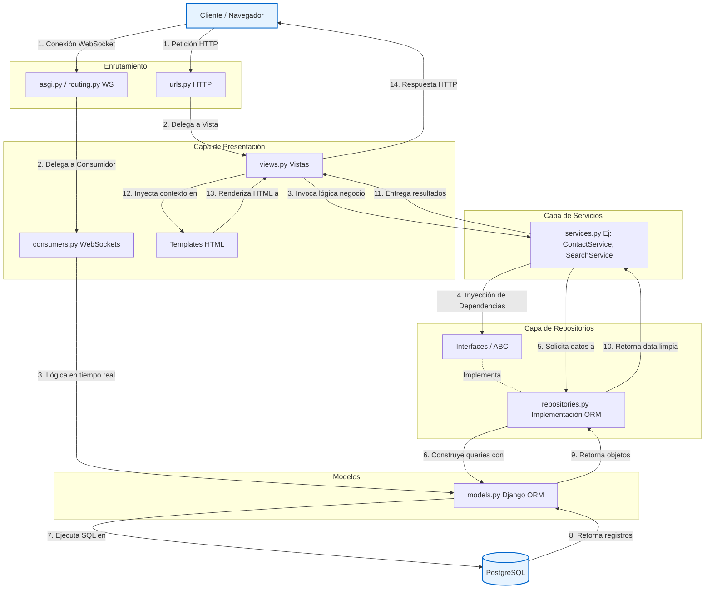

# Inmobilike It - Plataforma Inmobiliaria

Inmobilike It es una plataforma inmobiliaria moderna construida con **Django**, que implementa una arquitectura robusta (Repository Pattern y Service Layer) e incluye mensajería en tiempo real usando **Django Channels** (WebSockets).

## Características principales

- **Gestión de Propiedades**: Publicación y búsqueda avanzada de propiedades.
- **Interacciones de Usuarios**: Los usuarios pueden añadir propiedades a sus favoritos, hacer consultas sobre propiedades y contactar directamente a los propietarios.
- **Mensajería en tiempo real**: Chat integrado entre interesados y agentes/propietarios usando WebSockets.
- **Arquitectura Robusta**: Separación clara de responsabilidades en la capa de datos (Repositories), capa de lógica de negocio (Services) y capa de presentación (Views/Templates).

---

## Estructura del Proyecto

El proyecto está organizado en distintas aplicaciones (apps) según su dominio de negocio:
- `apps/core`: Configuraciones comunes y utilidades generales.
- `apps/accounts`: Gestión de perfiles de usuario, agentes y autenticación.
- `apps/properties`: Modelos, servicios y vistas de propiedades (incluyendo la búsqueda avanzada y comparación).
- `apps/interactions`: Lógica para favoritos, notificaciones, consultas, conversaciones y WebSockets.

### Arquitectura del Sistema

El proyecto implementa una arquitectura robusta basada en **Repository Pattern**, **Service Layer** y uso de **WebSockets** con Django Channels. El siguiente diagrama detalla cómo fluyen los datos en la aplicación:



---

## Instrucciones de Instalación (Local sin Docker)

### Prerrequisitos
- Python 3.10 o superior
- pip y virtualenv (recomendado)

### Pasos
1. **Clonar el repositorio**:
   ```bash
   git clone <url-del-repo>
   cd Inmobilike_It
   ```

2. **Crear y activar el entorno virtual**:
   ```bash
   python -m venv venv
   source venv/bin/activate  # En Linux/Mac
   # venv\Scripts\activate   # En Windows
   ```

3. **Instalar dependencias**:
   ```bash
   pip install -r requirements.txt
   ```

4. **Aplicar migraciones**:
   ```bash
   python manage.py migrate
   ```

5. **Iniciar servidor de desarrollo**:
   ```bash
   python manage.py runserver
   ```
   La plataforma estará disponible en `http://localhost:8000`.

---

## Ejecución con Docker

El proyecto incluye un entorno preconfigurado usando `docker-compose` que levanta la aplicación Django junto con una base de datos PostgreSQL. Para desarrollo, Django Channels usa `InMemoryChannelLayer`, por lo que no se requiere Redis en este `docker-compose.yml`.

### Pasos
1. Asegúrate de tener instalado **Docker** y **Docker Compose**.
2. Construir la imagen de Docker e iniciar los contenedores:
   ```bash
   docker-compose up --build
   ```
   *(Añade la bandera `-d` al final si quieres que se ejecute en segundo plano)*.

3. Aplicar migraciones en el contenedor (si es la primera vez):
   ```bash
   docker-compose exec web python manage.py migrate
   ```

4. Crear un superusuario (opcional):
   ```bash
   docker-compose exec web python manage.py createsuperuser
   ```

---

## Despliegue en Render

El proyecto ya incluye un archivo `render.yaml` que define el servicio web Docker y una base de datos PostgreSQL administrada.

### Requisitos
- Cuenta en Render
- Acceso al repositorio GitHub o importe del repositorio en Render

### Pasos rápidos
1. En Render, crea un nuevo servicio usando el repositorio de este proyecto.
2. Selecciona `Docker` como entorno de ejecución.
3. En `Render.yaml` deja la configuración predeterminada: el contenedor usará el `Dockerfile` del proyecto.
4. Verifica que las variables de entorno en Render incluyen:
   - `DEBUG=0`
   - `ALLOWED_HOSTS=*`
   - `CSRF_TRUSTED_ORIGINS=https://<tu-servicio>.onrender.com`
   - `SECRET_KEY` (o usa el generador de secrets de Render)

### Base de datos
Render creará un servicio PostgreSQL que expone `DATABASE_URL`. El proyecto ya está configurado para leer `DATABASE_URL` y usarlo en producción.

### Consideraciones
- El servicio usa `daphne` para Django Channels y WebSockets.
- WhiteNoise sirve archivos estáticos desde `STATIC_ROOT`.
- Si necesitas soporte de Redis para canales con múltiples instancias, tendrás que añadir una capa de `CHANNEL_LAYERS` en `config/settings.py`.

---

## Ejemplos de Uso

### 1. Búsqueda Avanzada de Propiedades
Para buscar propiedades por diferentes filtros (ubicación, precio, habitaciones, tipo de operación):
```python
from apps.properties.services.search_service import AdvancedSearchService

search_service = AdvancedSearchService()
resultados = search_service.search({
    "location": "Medellin",
    "operation": "rent",
    "min_price": 1000000,
    "bedrooms": 2
})
```

### 2. Contacto Directo con Propietario (Servicio con Transacciones)
El servicio de contacto crea de forma atómica una consulta (Inquiry) y, si es posible, inicia automáticamente una conversación en el chat.
```python
from apps.interactions.services.contact_service import ContactService

contact_service = ContactService()
inquiry, conversation = contact_service.initiate_contact(
    property_obj=propiedad,
    user=request.user,
    message="Me interesa agendar una visita a este apartamento."
)
```

### 3. Comparación de Propiedades
Para comparar múltiples propiedades y extraer métricas clave (ej. precio por m²):
```python
from apps.properties.services.comparison_service import ComparisonService

comparison_service = ComparisonService()
datos_comparativos = comparison_service.compare_properties([1, 4, 7])
```

### 4. API pública interna - Propiedades (JSON)

El proyecto expone un endpoint que devuelve un listado paginado de propiedades en formato JSON. Esto puede ser consumido por otros equipos o servicios.

- Ruta: `/properties/api/properties/`
- Parámetros GET: `page` (int), `page_size` (int), `city`, `neighborhood`, `operation`, `min_price`, `max_price`.
- Respuesta: JSON con `results` (lista), `page`, `page_size`, `total_pages`, `total`.

Ejemplo de uso con `curl`:

```bash
curl 'http://localhost:8000/properties/api/properties/?page=1&page_size=10'
```

## Internacionalización (i18n)

El proyecto usa el sistema estándar de internacionalización de Django (`` en plantillas y `gettext`/`gettext_lazy` en Python). Pasos para generar y compilar traducciones:

1. Extraer cadenas marcadas para traducción:

```bash
python manage.py makemessages -l en
```

2. Editar el archivo generado en `locale/en/LC_MESSAGES/django.po` y traducir las cadenas.

3. Compilar mensajes:

```bash
python manage.py compilemessages
```

Las traducciones en inglés están en `locale/en/LC_MESSAGES/django.po`; después de editarlas, compila el catálogo para actualizar `django.mo`.


