# Inmobilike It — Arquitectura del Sistema

> Documento técnico que describe la arquitectura general y el modelo de clases del proyecto **Inmobilike It**.

---

## 1. Diagrama de Arquitectura

El siguiente diagrama muestra cómo fluyen las peticiones del usuario a través de las distintas capas del sistema, incluyendo el flujo HTTP clásico, el canal WebSocket para mensajería en tiempo real y la integración con servicios externos (Stripe).

```mermaid
flowchart TB
    %% ─── Actores & Servicios Externos ───────────────────────────
    User[" Usuario / Navegador"]
    StripeAPI[" Stripe API"]
    PG[(" PostgreSQL")]

    %% ─── Capa de Entrada ────────────────────────────────────────
    subgraph EntryLayer [" Capa de Entrada — Protocolos"]
        direction LR
        ASGI["ASGI Application\n(config/asgi.py)"]
        HTTP["ProtocolTypeRouter\nHTTP"]
        WS["ProtocolTypeRouter\nWebSocket"]
    end

    %% ─── Middleware & Routing ───────────────────────────────────
    subgraph MiddlewareLayer [" Middleware & Enrutamiento"]
        direction LR
        DjangoMiddleware["Django Middleware\n(Session, CSRF, Auth)"]
        URLConf["URLConf\n(config/urls.py)"]
        AuthMW["AuthMiddlewareStack\n+ AllowedHostsOriginValidator"]
        WSRouting["WebSocket Routing\n(interactions/routing.py)"]
    end

    %% ─── Capa de Presentación ───────────────────────────────────
    subgraph PresentationLayer [" Capa de Presentación"]
        direction TB

        subgraph AccountsViews ["accounts/views.py"]
            Login["UserLoginView"]
            Register["register"]
            ToggleMode["toggle_mode"]
        end

        subgraph PropertiesViews ["properties/views.py"]
            Catalog["catalog"]
            Detail["property_detail"]
            Create["property_create"]
            Edit["property_edit"]
            Delete["property_delete"]
            Checkout["create_checkout_session"]
            PaySuccess["payment_success"]
            Webhook["stripe_webhook"]
        end

        subgraph InteractionsViews ["interactions/views.py"]
            ToggleFav["toggle_favorite"]
            InquiryCreate["inquiry_create"]
            ChatDashboard["chat_dashboard"]
            ClearNotifs["clear_chat_notifications"]
        end

        subgraph Consumers ["interactions/consumers.py"]
            ChatConsumer["ChatConsumer\n(AsyncWebsocketConsumer)"]
            NotifConsumer["NotificationConsumer\n(AsyncWebsocketConsumer)"]
        end

        Templates[" Templates HTML\n(templates/)"]
    end

    %% ─── Capa de Servicios ──────────────────────────────────────
    subgraph ServiceLayer [" Capa de Servicios — Lógica de Negocio"]
        direction LR
        PropertySvc["PropertyService\n(property_service.py)"]
        SearchSvc["AdvancedSearchService\n(search_service.py)"]
        ComparisonSvc["ComparisonService\n(comparison_service.py)"]
        FavoriteSvc["FavoriteService\n(favorite_service.py)"]
        ContactSvc["ContactService\n(contact_service.py)"]
    end

    %% ─── Capa de Repositorios ───────────────────────────────────
    subgraph RepositoryLayer [" Capa de Repositorios — Acceso a Datos"]
        direction LR
        SearchIface{{"«ABC»\nPropertySearchEngine"}}
        ORMSearch["ORMPropertySearch\n(orm_search.py)"]
        ESSearch["ElasticPropertySearch\n(elasticsearch_search.py)"]
        PropRepo["PropertyRepository\n(property_repository.py)"]
        FavRepo["FavoriteRepository\n(favorite_repository.py)"]
        InqRepo["InquiryRepository\n(inquiry_repository.py)"]
    end

    %% ─── Capa de Modelos ────────────────────────────────────────
    subgraph ModelLayer [" Capa de Modelos — Django ORM"]
        direction LR
        MUser["User\n(auth.User)"]
        MAgent["AgentProfile"]
        MLocation["Location"]
        MProperty["Property"]
        MImage["PropertyImage"]
        MPayment["PropertyPayment"]
        MFavorite["Favorite"]
        MInquiry["Inquiry"]
        MConversation["Conversation"]
        MMessage["Message"]
    end

    %% ═══ Flujos HTTP ════════════════════════════════════════════
    User -- "HTTP Request" --> ASGI
    ASGI --> HTTP
    HTTP --> DjangoMiddleware
    DjangoMiddleware --> URLConf
    URLConf --> AccountsViews
    URLConf --> PropertiesViews
    URLConf --> InteractionsViews

    %% ═══ Flujos WebSocket ═══════════════════════════════════════
    User -. "WebSocket Upgrade" .-> ASGI
    ASGI --> WS
    WS --> AuthMW
    AuthMW --> WSRouting
    WSRouting --> ChatConsumer
    WSRouting --> NotifConsumer

    %% ═══ Presentación → Servicios ═══════════════════════════════
    Catalog --> PropertySvc
    Detail --> PropertySvc
    Create --> PropertySvc
    Edit --> PropertySvc
    Catalog --> SearchSvc
    ToggleFav --> FavoriteSvc
    InquiryCreate --> ContactSvc

    %% ═══ Servicios → Repositorios ═══════════════════════════════
    PropertySvc --> PropRepo
    SearchSvc --> SearchIface
    SearchIface -. "implementa" .-> ORMSearch
    SearchIface -. "implementa" .-> ESSearch
    FavoriteSvc --> FavRepo
    ContactSvc --> InqRepo

    %% ═══ Repositorios / Consumers → Modelos ═════════════════════
    PropRepo --> MProperty
    ORMSearch --> MProperty
    FavRepo --> MFavorite
    InqRepo --> MInquiry
    ChatConsumer --> MConversation
    ChatConsumer --> MMessage
    ComparisonSvc --> MProperty

    %% ═══ Modelos → Base de Datos ════════════════════════════════
    ModelLayer --> PG

    %% ═══ Presentación → Templates ═══════════════════════════════
    PropertiesViews --> Templates
    InteractionsViews --> Templates
    AccountsViews --> Templates
    Templates --> User

    %% ═══ Stripe (externo) ═══════════════════════════════════════
    Checkout --> StripeAPI
    Webhook --> StripeAPI
    StripeAPI -- "webhook event" --> Webhook

    %% ═══ Estilos ════════════════════════════════════════════════
    classDef actor fill:#dbeafe,stroke:#2563eb,stroke-width:2px,color:#1e3a5f
    classDef external fill:#fef3c7,stroke:#d97706,stroke-width:2px,color:#78350f
    classDef db fill:#d1fae5,stroke:#059669,stroke-width:2px,color:#064e3b
    classDef iface fill:#fce7f3,stroke:#db2777,stroke-width:2px,color:#831843

    class User actor
    class StripeAPI external
    class PG db
    class SearchIface iface
```

### Descripción de las Capas

| Capa | Responsabilidad | Archivos clave |
|------|----------------|----------------|
| **Entrada (ASGI)** | Enruta según protocolo: HTTP o WebSocket | `config/asgi.py` |
| **Middleware & Routing** | Seguridad, sesión, autenticación y despacho de URLs | `config/urls.py`, `config/settings.py` |
| **Presentación** | Recibe la petición, invoca servicios y renderiza templates | `views.py`, `consumers.py`, `templates/` |
| **Servicios** | Lógica de negocio pura, transacciones atómicas y validaciones | `services/*.py` |
| **Repositorios** | Acceso a datos desacoplado, queries optimizadas con `select_related` / `prefetch_related` | `repositories/*.py` |
| **Modelos (ORM)** | Mapeo objeto-relacional con Django ORM | `models.py` |
| **Base de Datos** | PostgreSQL 16 ejecutado en Docker | `docker-compose.yml` |
| **Externo** | Pasarela de pagos Stripe (Checkout Sessions + Webhooks) | `views.py` (Stripe) |

---

## 2. Diagrama de Clases

El siguiente diagrama representa todas las clases del dominio, sus atributos, métodos principales y las relaciones entre ellas (herencia, composición, dependencia e implementación de interfaces).

```mermaid
classDiagram
    direction TB

    %% ═══════════════════════════════════════════════════════════
    %% MODELOS DE DOMINIO (Django ORM)
    %% ═══════════════════════════════════════════════════════════

    class User {
        +int id
        +str username
        +str email
        +str password
        +bool is_authenticated
        +str get_full_name()
    }

    class AgentProfile {
        +int id
        +User user
        +str phone
        +str agency_name
        +str __str__()
    }

    class Location {
        +int id
        +str city
        +str neighborhood
        +str address
        +str __str__()
    }

    class Property {
        +int id
        +str title
        +str description
        +str operation
        +Decimal price
        +int bedrooms
        +int bathrooms
        +Decimal area_m2
        +bool is_active
        +datetime created_at
        +Location location
        +AgentProfile agent
        +str OP_RENT$
        +str OP_SALE$
        +str __str__()
        +str get_operation_display()
    }

    class PropertyImage {
        +int id
        +Property property
        +ImageField image
        +str image_url
        +bool is_cover
        +str __str__()
    }

    class PropertyPayment {
        +int id
        +Property property
        +User user
        +Decimal amount
        +str currency
        +str status
        +str stripe_session_id
        +str stripe_payment_intent_id
        +datetime created_at
        +datetime paid_at
        +str STATUS_PENDING$
        +str STATUS_PAID$
        +str STATUS_CANCELED$
        +str STATUS_FAILED$
        +str __str__()
    }

    class Favorite {
        +int id
        +User user
        +Property property
        +datetime created_at
        +str __str__()
    }

    class Inquiry {
        +int id
        +Property property
        +User user
        +str name
        +str email
        +str message
        +datetime created_at
        +str __str__()
    }

    class Conversation {
        +int id
        +Property property
        +User buyer
        +User advisor
        +datetime created_at
        +datetime updated_at
        +str __str__()
    }

    class Message {
        +int id
        +Conversation conversation
        +User sender
        +str content
        +datetime created_at
        +bool is_read
        +str __str__()
    }

    %% ═══════════════════════════════════════════════════════════
    %% RELACIONES ENTRE MODELOS
    %% ═══════════════════════════════════════════════════════════

    User "1" --> "0..1" AgentProfile : tiene perfil agente
    AgentProfile "1" --> "0..*" Property : publica
    Location "1" --> "0..*" Property : ubica
    Property "1" --> "0..*" PropertyImage : posee imágenes
    Property "1" --> "0..*" PropertyPayment : recibe pagos
    Property "1" --> "0..*" Favorite : es favorita de
    Property "1" --> "0..*" Inquiry : recibe consultas
    Property "1" --> "0..*" Conversation : genera chats
    User "1" --> "0..*" Favorite : marca favoritos
    User "1" --> "0..*" Inquiry : realiza consultas
    User "1" --> "0..*" PropertyPayment : realiza pagos
    Conversation "1" --> "0..*" Message : contiene
    User "1" --> "0..*" Message : envía
    User "1" --> "0..*" Conversation : participa como buyer
    User "1" --> "0..*" Conversation : participa como advisor

    %% ═══════════════════════════════════════════════════════════
    %% CAPA DE REPOSITORIOS
    %% ═══════════════════════════════════════════════════════════

    class PropertySearchEngine {
        <<abstract>>
        +search(filters: dict) list*
    }

    class ORMPropertySearch {
        +search(filters: dict) list
    }

    class ElasticPropertySearch {
        +search(filters: dict) list
    }

    class PropertyRepository {
        +get_active_properties(filters)$ QuerySet
        +get_property_by_id(property_id)$ Property
        +get_properties_by_agent(agent)$ QuerySet
    }

    class FavoriteRepository {
        +is_favorite(user, property_obj) bool
        +get_or_create(user, property_obj) tuple
        +remove(user, property_obj) bool
    }

    class InquiryRepository {
        +create(**kwargs)$ Inquiry
    }

    PropertySearchEngine <|.. ORMPropertySearch : implementa
    PropertySearchEngine <|.. ElasticPropertySearch : implementa

    ORMPropertySearch ..> Property : consulta
    PropertyRepository ..> Property : consulta
    FavoriteRepository ..> Favorite : gestiona
    InquiryRepository ..> Inquiry : crea

    %% ═══════════════════════════════════════════════════════════
    %% CAPA DE SERVICIOS
    %% ═══════════════════════════════════════════════════════════

    class PropertyService {
        +list_active_properties(filters)$ QuerySet
        +get_property_detail(property_id)$ Property
        +get_agent_properties(agent)$ QuerySet
        +get_cover_image(property_obj)$ PropertyImage
        +get_property_images(property_obj)$ QuerySet
        +create_property(agent, location_form, property_form, files)$ Property
    }

    class AdvancedSearchService {
        -PropertySearchEngine search_engine
        +__init__(search_engine)
        +search(query_params: dict) list
    }

    class ComparisonService {
        +compare_properties(property_ids) list
    }

    class FavoriteService {
        -FavoriteRepository repository
        +__init__(repository)
        +is_favorite(user, property_obj) bool
        +add_to_favorites(user, property_obj) tuple
        +remove_from_favorites(user, property_obj) bool
    }

    class ContactService {
        -InquiryRepository repository
        +__init__(repository)
        +initiate_contact(property_obj, user, name, email, message) tuple
    }

    PropertyService --> PropertyRepository : delega a
    AdvancedSearchService --> PropertySearchEngine : usa (inyección)
    FavoriteService --> FavoriteRepository : delega a
    ContactService --> InquiryRepository : delega a
    ContactService ..> Conversation : crea o recupera
    ContactService ..> Message : crea mensaje inicial
    ComparisonService ..> Property : consulta directamente

    %% ═══════════════════════════════════════════════════════════
    %% CONSUMERS (WEBSOCKETS)
    %% ═══════════════════════════════════════════════════════════

    class ChatConsumer {
        -User user
        -str conversation_id
        -str room_group_name
        +connect()
        +disconnect(close_code)
        +receive(text_data)
        +chat_message(event)
        -user_in_conversation() bool
        -save_message(content) dict
    }

    class NotificationConsumer {
        -User user
        -str group_name
        +connect()
        +disconnect(close_code)
        +notify_message(event)
    }

    ChatConsumer ..> Conversation : valida pertenencia
    ChatConsumer ..> Message : persiste mensajes
    NotificationConsumer ..> User : notifica en tiempo real

    %% ═══════════════════════════════════════════════════════════
    %% FORMULARIOS
    %% ═══════════════════════════════════════════════════════════

    class LocationForm {
        +Meta: model=Location
        +fields: city, neighborhood, address
    }

    class PropertyForm {
        +CharField price
        +clean_price() Decimal
        +Meta: model=Property
    }

    class InquiryForm {
        +Meta: model=Inquiry
        +fields: name, email, message
    }

    LocationForm ..> Location : valida y crea
    PropertyForm ..> Property : valida y crea
    InquiryForm ..> Inquiry : valida datos
```

### Resumen de Clases por Capa

| Capa | Clases | Responsabilidad |
|------|--------|-----------------|
| **Modelos** | `User`, `AgentProfile`, `Location`, `Property`, `PropertyImage`, `PropertyPayment`, `Favorite`, `Inquiry`, `Conversation`, `Message` | Representación del dominio y mapeo a tablas PostgreSQL |
| **Repositorios** | `PropertySearchEngine` (ABC), `ORMPropertySearch`, `ElasticPropertySearch`, `PropertyRepository`, `FavoriteRepository`, `InquiryRepository` | Encapsulan el acceso a datos y construyen queries optimizadas |
| **Servicios** | `PropertyService`, `AdvancedSearchService`, `ComparisonService`, `FavoriteService`, `ContactService` | Orquestan la lógica de negocio, validaciones y transacciones atómicas |
| **Consumers** | `ChatConsumer`, `NotificationConsumer` | Gestionan conexiones WebSocket para chat y notificaciones en tiempo real |
| **Formularios** | `LocationForm`, `PropertyForm`, `InquiryForm` | Validación y limpieza de datos de entrada del usuario |

---

## Patrones de Diseño Aplicados

| Patrón | Uso en el Proyecto |
|--------|--------------------|
| **Repository Pattern** | `PropertyRepository`, `FavoriteRepository`, `InquiryRepository` desacoplan el ORM de la lógica de negocio |
| **Service Layer** | `PropertyService`, `FavoriteService`, `ContactService` centralizan la lógica de negocio |
| **Strategy Pattern** | `PropertySearchEngine` (ABC) permite intercambiar motores de búsqueda (ORM ↔ Elasticsearch) vía inyección de dependencias |
| **Dependency Injection** | `AdvancedSearchService` y `FavoriteService` reciben sus repositorios por constructor |
| **Unit of Work** | `ContactService.initiate_contact()` usa `@transaction.atomic` para garantizar consistencia transaccional |
| **Observer (Channel Layer)** | `ChatConsumer` propaga mensajes en tiempo real a todos los miembros del grupo vía `channel_layer.group_send()` |
